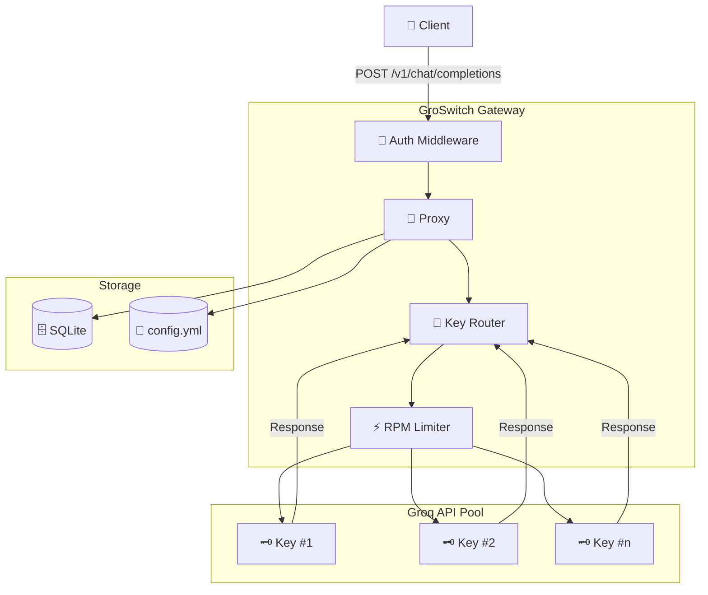
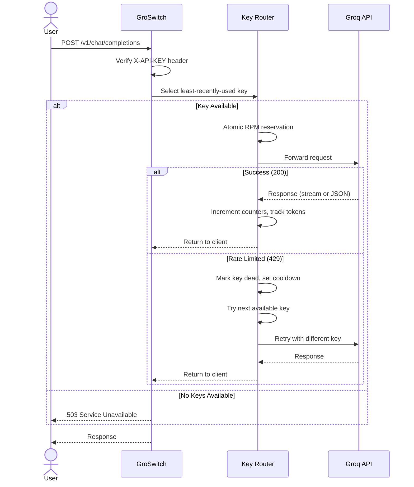

<div align="center">

# 🔀 GroSwitch

### ⚡ High-Performance Groq API Gateway & Multi-Key Router

A production-grade proxy that load-balances LLM requests across a pool of Groq API keys, with encrypted credential storage, atomic rate limiting, automatic failover, and a real-time dashboard.


</div>

---

## 🚀 First Request

Once the server is running, send your first chat completion request using `curl`
(or your favorite HTTP client):

```bash
curl -X POST http://localhost:8400/v1/chat/completions \
  -H "Content-Type: application/json" \
  -H "X-API-KEY: your-master-api-key" \
  -d '{
    "model": "llama-3.1-8b-instant",
    "messages": [
      {"role": "user", "content": "Hello! Who are you?"}
    ],
    "stream": false
  }'
```

> 💡 **Tip:** Replace `your-master-api-key` with the `MASTER_API_KEY` value you
> set in your `.env` file. Set `"stream": true` for streaming responses (SSE).

---

## 📚 Table of Contents

- [✨ Features](#-features)
- [🏗 Architecture](#-architecture)
- [📁 Monorepo Structure](#-monorepo-structure)
- [🧱 Tech Stack](#-tech-stack)
- [🚀 Quick Start](#-quick-start)
- [⚙️ Environment Variables](#️-environment-variables)
- [📡 API Reference](#-api-reference)
- [🤖 Supported Models](#-supported-models)
- [📸 Dashboard Preview](#-dashboard-preview)
- [🔄 How It Works](#-how-it-works)
- [🔒 Security](#-security)
- [🛣 Roadmap](#-roadmap)
- [🤝 Contributing](#-contributing)
- [📄 License](#-license)

---

## ✨ Features

| Feature | Status |
| --- | --- |
| 🔀 Multi-Key Load Balancing (LRU) | ✅ Done |
| ⚡ Sliding-Window Rate Limiting | ✅ Done |
| 📊 Daily Request Quota Tracking | ✅ Done |
| 🔄 Automatic Failover & Retry | ✅ Done |
| 🔐 AES-256-GCM Key Encryption | ✅ Done |
| 🌊 Streaming SSE Proxy | ✅ Done |
| 📈 Real-Time Dashboard | ✅ Done |
| 💬 Built-In Chat Interface | ✅ Done |
| 🖼️ Vision / OCR Testing UI | ✅ Done |
| 🎙️ Audio Transcription (STT) | ✅ Done |
| 🔊 Text-to-Speech (TTS) | ✅ Done |
| 🛡️ Prompt Guard / Moderation Testing | ✅ Done |
| 🤖 Per-Model Rate Limit Management | ✅ Done |
| 🧊 Cooldown-Based Dead Key Revival | ✅ Done |
| 🔍 Background Key Health Monitor | ✅ Done |
| 📋 17 Groq Models Pre-Configured | ✅ Done |

---

## 🏗 Architecture



### 🔄 Request Flow



---

## 📁 Monorepo Structure

```text
📦 groswitch/
├── 📂 apps/
│   ├── 🌐 backend/              # Fastify API server
│   │   ├── 🗄 prisma/           # Database schema & migrations
│   │   └── 📂 src/
│   │       ├── 🔧 lib/          # Crypto, env, prisma client
│   │       ├── 📦 modules/
│   │       │   ├── 🚀 proxy/    # Chat/vision/guard + audio (STT/TTS) proxy & retry logic
│   │       │   ├── 🔑 keys/     # Key CRUD & rate limiting
│   │       │   └── 🤖 models/   # Model rate limit + type (chat/vision/stt/tts/guard) management
│   │       ├── 🔌 plugins/      # Auth middleware
│   │       └── ⚙️ workers/      # Background key health monitor
│   │
│   └── 🎨 frontend/             # React SPA
│       └── 📂 src/
│           ├── 🧩 features/
│           │   ├── 🔐 auth/     # Login & session management
│           │   ├── 🔑 keys/     # Dashboard, key table, forms
│           │   ├── 🤖 models/   # Model rate limit editor
│           │   ├── 💬 chat/     # Built-in chat interface
│           │   ├── 🖼️ vision/    # Vision / OCR test page
│           │   ├── 🎙️ audio/     # Transcription (STT) + speech (TTS) test page
│           │   └── 🛡️ guard/     # Prompt Guard / moderation test page
│           └── 🧱 shared/       # UI components & utilities
│
├── 📦 packages/
│   └── 📐 common/               # Shared TypeScript types
│
├── 📖 docs/                     # Full API route reference (see below)
├── 📄 config.yml                # Default model configuration
├── 📝 .env.example              # Environment variable template
└── 📦 package.json              # Bun workspace root
```

---

## 🧱 Tech Stack

| Layer | Technology |
| --- | --- |
| 🏃 Runtime | [Bun](https://bun.sh) |
| ⚙️ Backend Framework | [Fastify 5](https://fastify.dev) |
| 🗄 ORM | [Prisma 6](https://www.prisma.io) |
| 💾 Database | SQLite (default) |
| 🎨 Frontend | [React 19](https://react.dev) |
| 📦 Bundler | [Vite 6](https://vitejs.dev) |
| 🧩 UI Components | [shadcn/ui](https://ui.shadcn.com) + [Radix UI](https://www.radix-ui.com) |
| 🎨 Styling | [Tailwind CSS 3](https://tailwindcss.com) |
| 🖼 Icons | [Lucide React](https://lucide.dev) |
| 🔐 Encryption | AES-256-GCM (scrypt key derivation) |
| 📝 Language | TypeScript 5 (strict) |

---

## 🚀 Quick Start

### 📋 Prerequisites

- [Bun](https://bun.sh) v1.0+
- A [Groq](https://console.groq.com) API key

### 1️⃣ Clone & Install

```bash
git clone https://github.com/your-username/groswitch.git
cd groswitch

# Linux:
chmod +x scripts/linux/*.sh
./scripts/linux/install.sh

# Windows:
scripts\windows\install.bat
```

Edit `.env` and set:

```env
MASTER_API_KEY=your-secret-master-key
MASTER_ENCRYPTION_KEY=at-least-32-characters-long!!
```

### 2️⃣ Development

```bash
bun run dev
```

Backend on port 8400, frontend on port 5173 with Vite proxying API calls.
Open [http://localhost:5173](http://localhost:5173).

### 3️⃣ Production (single port)

```bash
# Run from source (no build required):
./scripts/linux/run.sh

# On Windows:
scripts\windows\run.bat
```

Backend serves both API and frontend on port 8400.
Open [http://localhost:8400](http://localhost:8400).

> 💡 **Memory-constrained servers (Alwaysdata):** Build the frontend on your
> local machine and push `apps/frontend/dist/` to git. The install script
> skips the build step: it only runs `bun install` and `prisma db push`.
> ```bash
> git clone ... && cd GroSwitch
> bash scripts/linux/install.sh   # installs deps + prisma
> bash scripts/linux/run.sh        # starts from source
> ```

---

## ⚙️ Environment Variables

| Variable | Required | Default | Description |
| --- | --- | --- | --- |
| `MASTER_API_KEY` | ✅ Yes | — | 🔑 Authentication key for dashboard & API access |
| `MASTER_ENCRYPTION_KEY` | ✅ Yes | — | 🔐 Key derivation seed for AES-256-GCM encryption (32+ chars) |
| `PORT` | ❌ No | `8400` | 🚪 Backend server port (use 8300-8499 on Alwaysdata) |
| `DATABASE_URL` | ❌ No | `file:../../../dev.db` | 🗄 SQLite path (resolved relative to `apps/backend/prisma/`) |
| `GROQ_BASE_URL` | ❌ No | `https://api.groq.com/openai/v1` | 🌐 Groq API base URL |
| `KEY_MONITOR_INTERVAL_MS` | ❌ No | `60000` | 🔍 Background health check interval (ms) |

---

## 📡 API Reference

Every route has its own doc in [`docs/`](./docs) with method, headers, body, response shape, and error cases. All of them except `GET /health` require the `X-API-KEY` header. Start with [00-overview.md](./docs/00-overview.md) for auth, response envelopes, model types, and the retry/rate-limit logic shared by every `/v1/*` route.

| Method | Route | Doc |
| --- | --- | --- |
| `POST` | `/v1/chat/completions` | [01-chat-completions.md](./docs/01-chat-completions.md) |
| `POST` | `/v1/chat/completions/sync` | [02-chat-completions-sync.md](./docs/02-chat-completions-sync.md) |
| `POST` | `/v1/audio/transcriptions` | [03-audio-transcriptions.md](./docs/03-audio-transcriptions.md) |
| `POST` | `/v1/audio/speech` | [04-audio-speech.md](./docs/04-audio-speech.md) |
| `GET` | `/api/v1/models` | [05-models-list.md](./docs/05-models-list.md) |
| `GET` | `/api/v1/models/:model` | [06-models-get.md](./docs/06-models-get.md) |
| `PUT` | `/api/v1/models/:model` | [07-models-update.md](./docs/07-models-update.md) |
| `DELETE` | `/api/v1/models/:model` | [08-models-delete.md](./docs/08-models-delete.md) |
| `PUT` | `/api/v1/config` | [09-config-update.md](./docs/09-config-update.md) |
| `GET` | `/api/v1/keys` | [10-keys-list.md](./docs/10-keys-list.md) |
| `GET` | `/api/v1/keys/:id` | [11-keys-get.md](./docs/11-keys-get.md) |
| `POST` | `/api/v1/keys` | [12-keys-create.md](./docs/12-keys-create.md) |
| `PUT` | `/api/v1/keys/:id` | [13-keys-update.md](./docs/13-keys-update.md) |
| `GET` | `/api/v1/keys/:id/reveal` | [14-keys-reveal.md](./docs/14-keys-reveal.md) |
| `POST` | `/api/v1/keys/reset-tokens` | [15-keys-reset-tokens.md](./docs/15-keys-reset-tokens.md) |
| `DELETE` | `/api/v1/keys/:id` | [16-keys-delete.md](./docs/16-keys-delete.md) |
| `GET` | `/api/v1/stats` | [17-stats.md](./docs/17-stats.md) |
| `GET` | `/health` | [18-health.md](./docs/18-health.md) |
| `GET` | `/status` | [19-status.md](./docs/19-status.md) |

---

## 🤖 Supported Models

Pre-configured rate limits for all Groq models. `type` drives which route reaches each model. See [00-overview.md](./docs/00-overview.md#model-types):

| Model | Type | RPM | RPD | TPM |
| --- | --- | --- | --- | --- |
| `llama-3.1-8b-instant` | chat | 30 | 14,400 | 6,000 |
| `llama-3.3-70b-versatile` | chat | 30 | 1,000 | 12,000 |
| `qwen/qwen3-32b` | chat | 60 | 1,000 | 6,000 |
| `qwen/qwen3.6-27b` | chat | 30 | 1,000 | 8,000 |
| `openai/gpt-oss-120b` | chat | 30 | 1,000 | 8,000 |
| `openai/gpt-oss-20b` | chat | 30 | 1,000 | 8,000 |
| `groq/compound` | chat | 30 | 250 | 70,000 |
| `groq/compound-mini` | chat | 30 | 250 | 70,000 |
| `allam-2-7b` | chat | 30 | 7,000 | 6,000 |
| `meta-llama/llama-4-scout-17b-16e-instruct` | vision | 30 | 1,000 | 30,000 |
| `meta-llama/llama-prompt-guard-2-22m` | guard | 30 | 14,400 | 15,000 |
| `meta-llama/llama-prompt-guard-2-86m` | guard | 30 | 14,400 | 15,000 |
| `openai/gpt-oss-safeguard-20b` | guard | 30 | 1,000 | 8,000 |
| `whisper-large-v3` | stt | 20 | 2,000 | — |
| `whisper-large-v3-turbo` | stt | 20 | 2,000 | — |
| `canopylabs/orpheus-arabic-saudi` | tts | 10 | 100 | 1,200 |
| `canopylabs/orpheus-v1-english` | tts | 10 | 100 | 1,200 |

Rate limits are customizable per model through the dashboard or API. `type` is fixed metadata from the CSV and isn't editable through the API. See [04-models.md](./docs/04-models.md).

---

## 📸 Dashboard Preview

The dashboard provides real-time visibility into your key pool:

| 📊 Stat Cards | 🔑 Key Table |
| --- | --- |
| Active keys, rate-limited keys, daily requests, total tokens | Per-key usage bars, status badges, cooldown timers |

| 🤖 Models Page | 💬 Chat Interface |
| --- | --- |
| Inline-editable RPM/RPD/TPM per model, type badges | Streaming chat with token metrics and latency breakdown |

| 🖼️ Vision / Audio / Guard |
| --- |
| Image upload + OCR prompt, audio record/upload + transcript, text-to-speech player, prompt-guard classification, all in the same raw-request style as Chat |

---

## 🔄 How It Works

### 🔑 Key Selection

Keys are selected using a **least-recently-used (LRU)** strategy. When a request arrives, the system queries for keys that are:

1. 🟢 **Not dead** (or dead but cooldown has expired)
2. 📊 **Not at daily limit** for the current date
3. ⚡ **Not at RPM limit** for the current minute window

The least-recently-used key is picked, and an **atomic RPM reservation** prevents concurrent over-admission.

### ⏱️ Rate Limiting

Two independent counters per key per model:

- 📅 **Daily (RPD):** Date-string based, resets at midnight
- ⚡ **Per-Minute (RPM):** Sliding window (60s), not fixed clock minutes.
  Cooldown starts from the first request in the window, not from the next
  `:00` boundary. Each key's cooldown is calculated from its own window start.

### 🔄 Failover

When a key returns a rate limit (429):

1. Marks the key `dead` with a cooldown from the `Retry-After` header
2. Retries with the next available key
3. Single-key mode retries up to 3 times with backoff

Keys returning 401/403 are permanently marked `invalid`.

### 🔍 Background Monitor

A background worker runs every 60 seconds (configurable) to:

- Clear stale sliding-window counters
- Roll over daily counters for the new day
- Revive keys whose cooldown has expired

### 📊 Token Tracking

Every successful response tracks `prompt_tokens`, `completion_tokens`, and `total_tokens`. The dashboard displays cumulative token usage across all keys.

---

## 🔒 Security

- 🔐 **AES-256-GCM encryption** for all stored Groq credentials (scrypt key derivation with random salt per encryption)
- ⏱️ **Timing-safe comparison** for master API key verification (prevents timing attacks)
- 🚫 **No credentials in responses:** the public API format strips encrypted key fields
- 🔄 **401 auto-logout:** expired sessions clear stored credentials and redirect to login
- 🏢 **Vault-backed production:** for production use, integrate with HashiCorp Vault or AWS Secrets Manager instead of local encryption

---

## 🛣 Roadmap

- [x] 🔀 Multi-key routing with LRU selection
- [x] ⚡ Atomic per-minute rate limiting
- [x] 📊 Daily request quota tracking
- [x] 🔄 Automatic failover & retry
- [x] 🔐 AES-256-GCM key encryption
- [x] 🌊 Streaming SSE proxy
- [x] 📈 Real-time dashboard
- [x] 💬 Built-in chat interface
- [x] 🖼️ Vision / OCR testing UI
- [x] 🎙️ Audio transcription (STT) + text-to-speech (TTS) testing UI
- [x] 🛡️ Prompt Guard / moderation testing UI
- [x] 🤖 Per-model rate limit management
- [x] 🔍 Background key health monitor
- [ ] 🐳 Docker & Docker Compose support
- [ ] ☸️ Kubernetes Helm chart
- [ ] 🔌 OpenAI-compatible API format
- [ ] 📣 Webhook notifications for key events
- [ ] 🌐 Distributed clustering with Redis
- [ ] 🔑 OAuth2 / OIDC authentication

---

## 🤝 Contributing

<details>
<summary>🚀 Getting started</summary>

1. 🍴 Fork the repository
2. 🌿 Create a feature branch (`git checkout -b feat/my-feature`)
3. ✏️ Make your changes
4. ✅ Run `bun run build` to verify
5. 💾 Commit your changes
6. 🚀 Push to your branch and open a Pull Request

</details>

<details>
<summary>🛠 Development commands</summary>

```bash
bun run dev              # 🔃 Start backend + frontend
bun run dev:backend      # 🌐 Backend only
bun run dev:frontend     # 🎨 Frontend only
bun run build            # 📦 Build all packages
bun run db:push          # 🗄 Push schema to database
bun run db:studio        # 🖥 Open Prisma Studio
bun run db:generate      # 🔧 Regenerate Prisma client
```

</details>

---

## 📄 License

MIT
